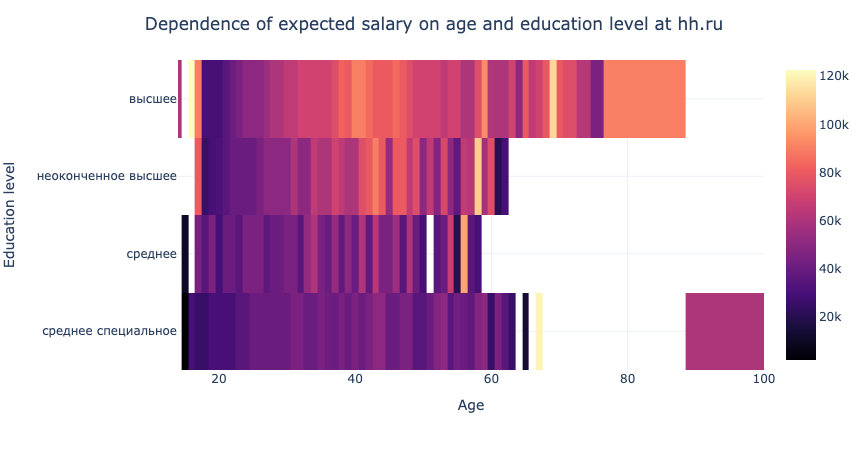
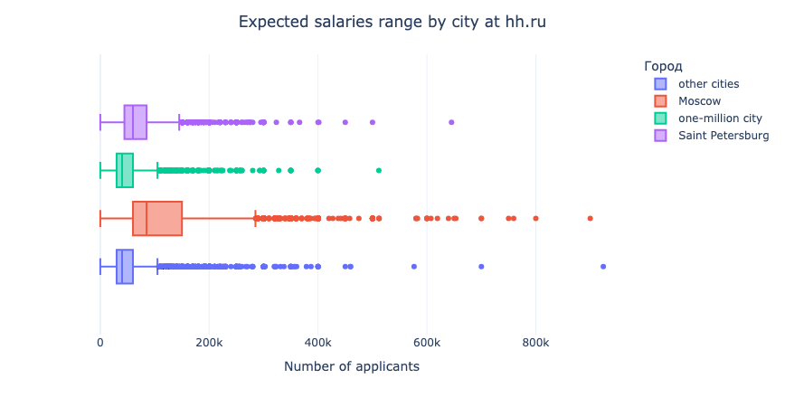
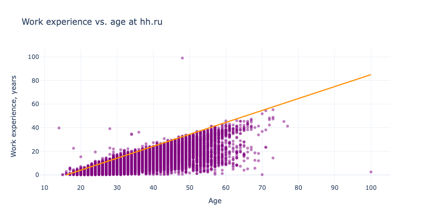

# Head Hunter CV database data cleaning

### Project Overview

The project involves the analysis of a resume database obtained from the job search website hh.ru. This database serves to match job seekers with suitable job vacancies and vice versa, connecting employers with suitable specialists.

One of the main challenges addressed in this analysis is the presence of missing data, particularly regarding the desired salary of job seekers in their resumes.

### Objective

The primary objective of this project is to transform, explore, and clean the data in preparation for building a model, which automatically estimate the approximate salary level that suits a user based on the information provided in their resume.

### Project stages

* **Basic Analysis of Data Structure:** Examination of the structure of the dataset, identifying features/columns, understanding data types of each feature, and the overall dataset structure.
* **Data Transformation:** Transforming the raw data into a structured format suitable for analysis, ensuring uniformity in data representation across all features.
* **Exploratory Data Analysis (EDA):** Visual and statistical analysis to gain insights into the dataset, exploring relationships and dependencies between different features, identifying patterns, trends, and outliers.
* **Data Cleaning:** Addressing any data quality issues identified during the EDA stage, removing duplicates, outliers, and irrelevant data points, and handling missing values.

### Technology Stack

Python
Pandas
Numpy
Plotly Express

### Conclusions

The raw CSV data has been effectively transformed into a structured dataset with distinct and usable features.
Visual exploratory data analysis has revealed dependencies between salary and other features such as location, age, education, experience, and unfortunately, gender.
Approximately 200 duplicates and outliers were identified and removed during the data cleanup process, and all empty values have been appropriately handled.

### Examples of visualisations 

